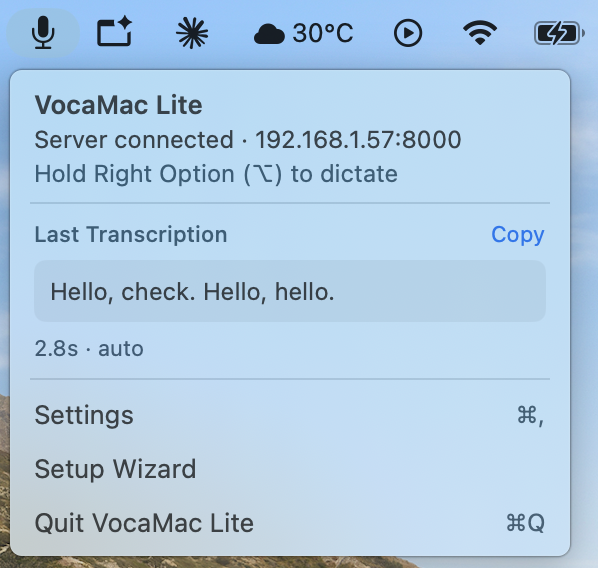

# VocaMac Lite

**Menu-bar dictation for macOS that transcribes on *your own* server.**

An **efficiency-focused fork** of [VocaMac](https://github.com/jatinkrmalik/vocamac) by Jatin Kumar Malik. Huge thanks to the original project — the app, the audio pipeline, and the UX all come from upstream, and this fork simply stands on its shoulders. Where VocaMac runs a Whisper model locally, VocaMac Lite moves all transcription to a remote server so the Mac app itself stays lean.

Hold a hotkey, speak, and your words are typed wherever your cursor is. Audio is recorded locally (16 kHz mono WAV) and sent to a Whisper server you run — on your LAN box, homelab, or any OpenAI-compatible API. Nothing is transcribed on the Mac itself: no local AI model, no gigabytes of RAM, safe to keep running from login.

<p align="center"></p>

## Features

- **Remote-only transcription** — the app has a single job: record audio and send it to a Whisper server you control. There's no bundled AI model, so your server does the heavy lifting and the Mac app stays lightweight.
- **Tiny download** — the DMG is under 5 MB (~2.8 MB).

## How it works

```
hotkey ──▶ mic (16 kHz WAV) ──▶ POST to your server ──▶ text typed at your cursor
```

Two server API formats are supported (pick one in Settings → Endpoint):

| Format | Endpoint | Works with |
|---|---|---|
| OpenAI-compatible | `POST /v1/audio/transcriptions` | Speaches, faster-whisper-server, LocalAI, OpenAI |
| whisper.cpp server | `POST /inference` | whisper.cpp's bundled `whisper-server` |

## Install

**Homebrew (recommended):**

```bash
brew tap vajahath/vocamac-lite
brew trust vajahath/vocamac-lite
brew install --cask vocamac-lite
xattr -dr com.apple.quarantine "/Applications/VocaMac Lite.app"   # allow the unsigned app to launch
```

**Manual:** download the DMG from [Releases](https://github.com/vajahath/vocamac-lite/releases), drag VocaMac Lite to Applications, then run the same `xattr` command (or right-click the app → Open → Open).

> The `xattr` step is needed because builds are not signed with an Apple Developer ID (no paid developer account). The source is right here — build it yourself if you prefer. VocaMac Lite installs as `VocaMac Lite.app` (bundle id `com.vocamac.lite`), so it runs **side by side with the original [VocaMac](https://github.com/jatinkrmalik/vocamac)** — no conflict, no need to uninstall anything.

On first launch, the setup wizard walks you through permissions (Microphone, Accessibility, Input Monitoring), your server endpoint, and the hotkey.

## Set up a transcription server

VocaMac Lite needs a Whisper server to talk to. The companion project below is the engine it's built around.

### [whisper-stt-server](https://github.com/vajahath/whisper-stt-server) — the recommended engine

A companion project built specifically for VocaMac Lite: a ready-to-run, GPU-accelerated Whisper server (faster-whisper large-v3) for Windows machines with an NVIDIA GPU. No Docker — just PowerShell.

```powershell
git clone https://github.com/vajahath/whisper-stt-server.git
cd whisper-stt-server
.\start_server.ps1
```

The script sets up its own Python environment, downloads the model on first run, opens the Windows Firewall port, and prints the LAN URL to paste into VocaMac Lite. See [its README](https://github.com/vajahath/whisper-stt-server) for GPU/CUDA prerequisites and troubleshooting.

→ Format: *OpenAI-compatible*, URL: `http://<server-ip>:8000`, Model: `Systran/faster-whisper-large-v3`

### Other servers

Any OpenAI-compatible (`POST /v1/audio/transcriptions`) or whisper.cpp (`POST /inference`) server works too — for example Speaches, faster-whisper-server, LocalAI, whisper.cpp's bundled `whisper-server`, or OpenAI's hosted API. Point VocaMac Lite at it in **Settings → Endpoint** and pick the matching format. (With OpenAI's hosted API your audio leaves your network — that's the tradeoff.)

Use the **Test Connection** button in Settings → Endpoint (or the setup wizard) to verify — it sends a short silent clip through the real transcription path.

## Settings overview

- **General** — activation mode (push-to-talk / double-tap toggle), hotkey, transcription language, translation toggle, custom vocabulary (sent to the server as a prompt hint), clipboard preservation, launch at login
- **Endpoint** — server URL, API format, optional API key (Bearer), optional model name, test connection
- **Stats** — words dictated, time saved
- **Audio** — input device, silence auto-stop, max recording duration, sound effects
- **Debug** — permission status/reset, log export

## Security notes

- The API key is stored **unencrypted** in app preferences (`~/Library/Preferences/com.vocamac.lite.plist`). Plain HTTP is fine on a trusted LAN; use HTTPS + an API key for anything beyond it.
- Releases are signed with a stable self-signed certificate, so macOS keeps your Accessibility and Input Monitoring grants across updates. (The Debug tab has a permission reset if anything ever gets stuck.)

## Build from source

Requires macOS 13+ and Xcode (for `xcodebuild` and XCTest).

```bash
git clone https://github.com/vajahath/vocamac-lite.git
cd vocamac-lite
make install   # build + install to /Applications
make test      # run the test suite
```

## Releasing (maintainer)

```bash
make release VERSION=x.y.z
```

This tags `vx.y.z` and pushes; GitHub Actions then runs the tests, builds an unsigned DMG (`release.yml`), publishes a GitHub Release, and updates the Homebrew tap (`update-homebrew-cask.yml`, requires the `HOMEBREW_TAP_TOKEN` secret and the `vajahath/homebrew-vocamac-lite` tap repo — see [homebrew/README.md](homebrew/README.md)). The DMG is also downloadable as a workflow artifact from the Actions run.

## License

[AGPL-3.0](LICENSE). Forked from [jatinkrmalik/vocamac](https://github.com/jatinkrmalik/vocamac) — all credit for the original app, audio pipeline, and UX goes upstream.
